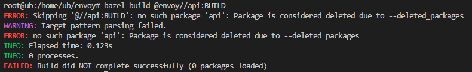
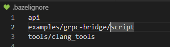

## 日志
- Envoy 的日志级别  
  支持多种日志级别：  
  - trace: 最详细的日志信息，用于追踪详细的内部状态。  
  - debug: 用于调试目的的日志信息。  
  - info: 通常用于记录普通的运行状态。
  - warn: 用于记录可能会导致问题的警告。
  - error: 用于记录错误信息。
  - critical: 用于记录严重错误信息，通常会导致程序退出。
- 使用日志宏
  Envoy 提供了一系列的日志宏，可以在你的代码中使用这些宏来输出日志信息。常见的日志宏有：  
  - ENVOY_LOG(trace, "message")
  - ENVOY_LOG(debug, "message")
  - ENVOY_LOG(info, "message")
  - ENVOY_LOG(warn, "message")
  - ENVOY_LOG(error, "message")
  - ENVOY_LOG(critical, "message")  
  这些宏可以用于任何代码位置，例如你的自定义过滤器中。

  ## 单个拓展编译
  - 以echo为例
  ```
   bazel build //source/extensions/filters/network/echo
  ```

  ## 编译compile_command.json
  运行
  ```
  ./tools/gen_compilation_database.py
  ```
  ## 调试
  使用这个目录下的envoy进行gdb调试，其他的没有关联dwo文件
  ```
  ./bazel-bin/source/exe/envoy-static
  ```
# 自定义Filter开发

##  1 编译rsa_filter的 Protobuf 文件
- 解决编译proto时，报错api已被删除的问题


   - 在.bazelignore中去掉api
   
   - 在api目录重新编译proto成功
   ```
   bazel build @envoy//api:BUILD
   ```
