## WhiteList流程



## 代码实现
```
#include "envoy/http/filter.h"
#include "envoy/http/async_client.h"
#include "envoy/server/filter_config.h"

class AuthFilter : public Http::StreamDecoderFilter, public Http::AsyncClient::Callbacks {
public:
  AuthFilter(Server::Configuration::FactoryContext& context) : context_(context) {}

  // 拦截请求头并发送鉴权请求
  FilterHeadersStatus decodeHeaders(Http::RequestHeaderMap& headers, bool end_stream) override {
    // 构造发送给鉴权服务的请求
    Http::RequestMessagePtr req_message = std::make_unique<Http::RequestMessageImpl>(
      std::make_unique<Http::RequestHeaderMapImpl>());

    // 发起异步请求到鉴权服务
    auto async_client = context_.clusterManager().httpAsyncClientForCluster("auth_service");
    async_client.send(std::move(req_message), *this, Http::AsyncClient::RequestOptions().setTimeout(std::chrono::milliseconds(5000)));

    // 暂停请求处理，等待鉴权服务返回结果
    return FilterHeadersStatus::StopIteration;
  }

  // 鉴权成功的处理
  void onSuccess(const Http::AsyncClient::Request&, Http::ResponseMessagePtr&& response) override {
    // 假设鉴权服务返回的内容在 body 中，"true" 表示鉴权不通过，"false" 表示鉴权通过
    std::string body = response->bodyAsString();

    if (body == "true") {
      // 鉴权不通过，返回 401
      callbacks_->sendLocalReply(Http::Code::Unauthorized, "Unauthorized", nullptr, absl::nullopt, "");
    } else {
      // 鉴权通过，继续处理请求
      callbacks_->continueDecoding();
    }
  }

  // 鉴权失败或请求失败的处理
  void onFailure(const Http::AsyncClient::Request&, Http::AsyncClient::FailureReason) override {
    // 鉴权请求失败，继续处理请求（默认为通过）
    callbacks_->continueDecoding();
  }

  // 设置过滤器回调
  void setDecoderFilterCallbacks(Http::StreamDecoderFilterCallbacks& callbacks) override {
    callbacks_ = &callbacks;
  }
```


## 
  Http::ResponseMessagePtr response_message(new Http::ResponseMessageImpl(
      Http::ResponseHeaderMapPtr{new Http::TestResponseHeaderMapImpl{{":status", "200"}}}));

## host转发

```
    auto& stream_info = callbacks_->streamInfo();
    auto cluster_info_ptr = stream_info.upstreamClusterInfo();
    if (cluster_info_ptr.has_value()) {
        auto ci_ptr = cluster_info_ptr.value();
        auto cluster_name = ci_ptr->name();
        ENVOY_LOG(info, "{} get local cluster={}", __func__, cluster_name);
        cluster_ = context_->clusterManager().getThreadLocalCluster(cluster_name);
    } else {
        return FilterHeadersStatus::Continue;
    }
```