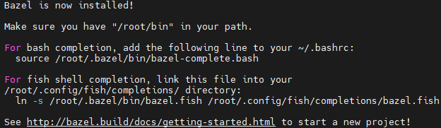

## 下载Bazel安装包
这里使用国内的镜像源，否则下载会很慢
```
wget https://mirrors.huaweicloud.com/bazel/6.3.2/bazel-6.3.2-installer-linux-x86_64.sh
```  

## 增加可执行权限
```
chmod +x bazel-6.3.2-installer-linux-x86_64.sh
```

## 执行安装脚本
--user, 表示  
将Bazel安装到系统上的$HOME/bin目录中  
将.bazelrc路径设置为$HOME/.bazelrc
```
./bazel-6.3.2-installer-linux-x86_64.sh --user
```

安装结束，提示如下说明安装成功


## 配置环境变量

编辑~/.bashrc 在文件末尾追加配置

```
export PATH="$PATH:$HOME/bin"
```

验证bazel的版本，说明配置OK
```
bazel --version
bazel 6.3.2
```