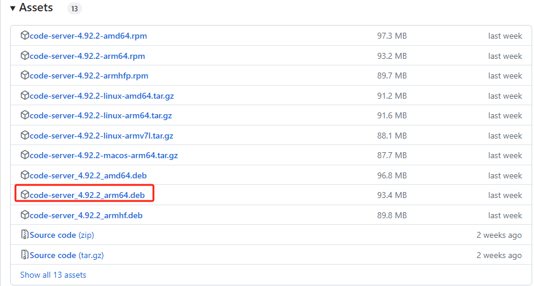

## 下载code-server安装包
https://github.com/coder/code-server/releases  



## 安装
```
sudo dpkg -i code-server_<version>_amd64.deb
```   

## 配置systemctl

创建日志目录  
```
mkdir -p /var/log/code-server/
```
  
配置systemctl  
在目录/etc/systemd/system/中，创建code-server.service文件，更新如下配置
```
[Unit]
Description=code-server
Documentation=https://github.com/coder/code-server
After=network.target

[Service]
Type=simple
User=root
ExecStart=/usr/bin/code-server --bind-addr 0.0.0.0:8080
Restart=on-failure
StandardOutput=file:/var/log/code-server/code-server.log
StandardError=file:/var/log/code-server/code-server.log

[Install]
WantedBy=multi-user.target
```

重启守护进程
```
systemctl daemon-reload
```

启动\停止\状态
```
systemctl start code-server
systemctl stop code-server
systemctl status code-server
```

## 浏览器访问code-server

- 修改登录秘钥配置
  ```
  vim ~/.config/code-server/config.yaml
  bind-addr: 0.0.0.0:8080
  auth: password
  password: xxx
  cert: false
  ```
