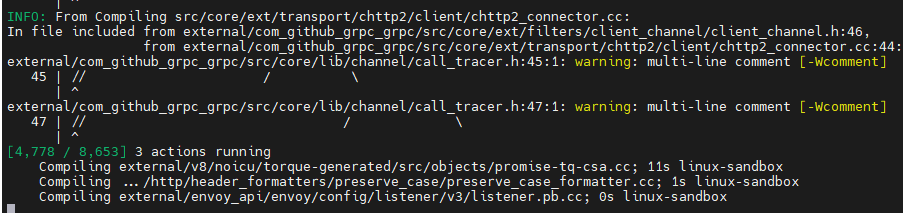
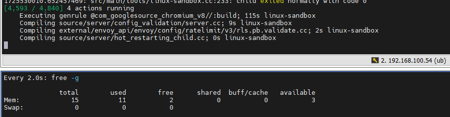

## 准备工作
- 1、创建一个istio用户  
由于python 解释器时不支持 root 用户，与 Bazel 的 hermetic Python interpreter 规则有关。
```
sudo adduser istio
sudo usermod -aG sudo istio
su - istio
```

- 2、源码下载，版本tags/1.28.3
```
git clone --branch release/v1.28 --single-branch https://github.com/envoyproxy/envoy.git

git checkout tags/v1.28.3 -b 1.28.3
```

- 3、虚拟机配置建议  8 + 32G

## Clang+LLVM工具链安装
- 官方推荐使用14的版本  
    - 添加LLVM官方仓库
    ```
    # 导入 LLVM 官方的 GPG 密钥
    wget https://apt.llvm.org/llvm-snapshot.gpg.key

    sudo apt-key add llvm-snapshot.gpg.key  

    # 添加 LLVM 官方仓库到系统源列表中  
    echo "deb http://apt.llvm.org/focal/ llvm-toolchain-focal-14 main" | sudo tee /etc/apt/sources.list.d/llvm.list  

    # 导入新的GPG公钥
    sudo apt-key adv --keyserver keyserver.ubuntu.com --recv-keys 15CF4D18AF4F7421
    ```
    - 安装
    ```
    sudo apt update
    sudo apt install clang-14 lld-14 llvm-14
    ```
    - 创建软连
    ```
    sudo ln -s /usr/local/llvm/bin/clang /usr/local/bin/clang
    sudo ln -s /usr/local/llvm/bin/clang++ /usr/local/bin/clang++
    sudo ln -s /usr/local/llvm/bin/llvm-config /usr/local/bin/llvm-config
    sudo ln -s /usr/local/llvm/bin/lld /usr/local/bin/lld

    ```


- 运行脚本
```
bazel/setup_clang.sh 
```
- 这将在 Envoy 源根目录中设置一个文件。如果要将 clang 设为默认，请运行以下命令：clang.bazelrc
```
echo "build --config=clang" >> user.bazelrc
```
注意：必须安装 or（或更高版本）。libc++libstdc++-7-dev

## Bazel 构建
- 1、安装外部依赖(在root用户下执行)
```
sudo apt-get install \
   autoconf \
   curl \
   libtool \
   patch \
   python3-pip \
   unzip \
   virtualenv
```
- 2、安装GoLang(在root用户执行)
```
apt install -y golang
```
手动安装1.16.3版本的golang
```
wget https://golang.org/dl/go1.16.3.linux-amd64.tar.gz
tar -C /usr/local -xzvf go1.16.3.linux-amd64.tar.gz
export PATH=$PATH:/usr/local/go/bin
source ~/.bashrc
go env -w GOPROXY=https://goproxy.cn,direct
```


- 3、安装buildifier、buildozer(在istio用户执行)
- 设置代理
```
$ export GO111MODULE=on
$ export GOPROXY=https://goproxy.cn
```
- 安装  
```
go install github.com/bazelbuild/buildtools/buildifier@latest
go install github.com/bazelbuild/buildtools/buildozer@latest
```
- 4、创建buildifier、buildozer的可执行软连接

```
ln -s /home/istio/go/bin/buildifier /usr/bin/buildifier
ln -s /home/istio/go/bin/buildozer /usr/bin/buildozer
```
5、在Envoy源目录下构建项目  

- 设置代理  
```
ub@ub:~/envoy$ export http_proxy="http://192.168.102.11:7890"
ub@ub:~/envoy$ export https_proxy="http://192.168.102.11:7890"
```
- 构建及编译
```
bazel build envoy
```
如果内存资源比较有限，可以指定线程数
```
bazel build envoy --jobs=4 --sandbox_debug
```

如下，说明envoy工程在成功构建



## 报错
- util依赖不全
```
1725524354.243728032: src/main/tools/linux-sandbox-pid1.cc:393: child started with PID 2
compilepkg: missing strict dependencies:
        /root/.cache/bazel/_bazel_ub/cebe444c192b8b83e97b169a23b1fd31/sandbox/linux-sandbox/13/execroot/envoy/external/com_github_spf13_afero/util.go: import of "golang.org/x/text/unicode/norm"
No dependencies were provided.
Check that imports in Go sources match importpath attributes in deps.
```
解决方法  
在com_github_spf13_afero的deps中新增Unicode/norm
```
deps = [
        "//mem",
        "@org_golang_x_text//transform:go_default_library",
        "@org_golang_x_text//unicode/norm:go_default_library",  # 添加对unicode/norm的依赖
    ],
```

- catch error
```
external/envoy/contrib/sip_proxy/filters/network/source/router/router_impl.h:244:19: error: catching polymorphic type 'class std::out_of_range' by value [-Werror=catch-value=]
  244 |     } catch (std::out_of_range) {
      |                   ^~~~~~~~~~~~
cc1plus: all warnings being treated as errors

```

解决方法  
```
(1) 将std:out_of_range改成 const std::out_of_range& e,这种规范用法
(2) 在bazel编译的时候加入参数 -Werror=catch-value=
```

- 3 宏定义不规范产生告警
```
./extensions/common/istio_dimensions.h:60:39: error: unnecessary parentheses in declaration of 'downstream_ip' [-Werror=parentheses]
```
解决方法
```
(1) 同样可以修改源码，规范用法
(2) bazel编译时指定参数 -Werror=parentheses
```

- 4 缺少strlcpy函数  
    strlcpy 是 BSD 系统中的一个字符串处理函数，不在标准的 Linux C 库中.  
    安装libbsd
    ```
    sudo apt-get update
    sudo apt-get install libbsd-dev
    ```
    bazel build 时，直接指定链接选项：
    ```
    bazel build //your_target --linkopt="-lbsd"
    ```

- 4 或者直接忽略告警进行编译
```
bazel build --keep_going --copt=-w --cxxopt=-w --copt=-Wno-error  --cxxopt=-Wno-error --linkopt="-lbsd" --jobs=16 -c opt //...
```

- 有时需要查看报错详情，可以添加编译参数 --sandbox_debug  
- 需要更详细的信息可以使用--verbose_explanations

## 建议
配置尽量高一点，8 + 16G的开4个线程：  
内存基本拉满，编译耗时也很长(大于4h)
